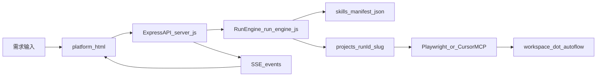

# AutoFlow 内审介绍文档

## 1. 评审目的与范围

- 目的：用于内部同事对齐 AutoFlow 当前实现、运行流程与可优化项，支撑后续迭代决策。
- 范围：聚焦仓库内可运行的核心平台 `visualization/`，以及与其强相关的流程、测试与证据链。
- 评审口径：先事实（当前实现）后建议（优化方向），每条结论尽量绑定到具体文件或脚本。

---

## 2. 项目定位（一句话）

AutoFlow 是一个本地可运行的 AI 软件工程闭环平台，将“需求输入 -> 架构拆解 -> 协作开发 -> 测试执行 -> 失败分析与修复 -> 稳定收敛”串成可观测、可追溯的流水线，并通过 `skills-manifest.json` 对每一步进行 skill 契约约束。

---

## 3. 系统架构概览

### 3.1 主要模块

- `visualization/platform.html`：前端操作台（步骤勾选、运行、日志与状态展示）。
- `visualization/server.js`：Express API 与 SSE 入口，负责 run 创建、事件推送、子项目启动/停止等。
- `visualization/run-engine.js`：核心状态机，负责步骤 1~8 编排、CDP/Playwright 路径、失败回路与证据产物。
- `visualization/skills-manifest.json`：步骤与 skills 的固定映射（strict mode）。
- `visualization/projects/<runId>-<slug>/`：每次需求生成的独立工作区。
- `visualization/projects/.../.autoflow/`：每次运行证据（策略、日志、报告等）。

### 3.2 架构关系图

---

## 4. 端到端流程（1~8 步）

### 4.1 输入与编排

1. 前端调用 `POST /api/runs` 提交 `requirement`，可携带 `enabledStepIds`、`cdpDriver`、`targetPlatform` 等参数。
2. `server.js` 创建 run 对象并调用 `startRun()` 进入引擎执行。
3. `run-engine.js` 根据 `enabledStepIds` 决定步骤是否执行。

### 4.2 业务执行与测试回路

1. 步骤 1~4：需求记录、架构拆解、开发协作、测试策略生成。
2. 步骤 5：默认执行 `npx playwright test tests`（在子项目目录）；可切换 `cdpDriver=cursor_mcp`。
3. 步骤 6~7：失败分析与自动修复；通过后进入步骤 8 收敛。
4. 每轮状态与日志通过 SSE (`/api/runs/:id/events`) 实时推送给前端。

### 4.3 关键流程规则（需重点同步）

- 若未启用步骤 5，步骤 4 结束后会按设计直接结束主流程，步骤 5~7 记为 `skipped`。
- 同一工作区重复运行时，`.autoflow/` 证据会更新覆盖，不会自动做历史版本保留。

---

## 5. 运行与验证方式

### 5.1 平台启动

- 根目录：`npm start`（通过 workspace 启动 `visualization`，默认端口 4173）。
- 子目录：`cd visualization && npm start`（`server.js` 默认端口 4180）。

### 5.2 测试命令

- 根目录：`npm test`（转发到 `visualization`）。
- 平台目录：`npm test`（`playwright test`，配置见 `visualization/playwright.config.js`）。
- CDP 自检：`npm run verify:cdp`（脚本 `scripts/verify-cdp.cjs` + `cdp-test-runner.js`）。

### 5.3 证据查看路径

- 每次运行主证据：`visualization/projects/<runId>-<slug>/.autoflow/report.md`
- 分轮日志：`05_test_round_*.log`、`06_failure_analysis_round_*.md`、`07_fix_round_*.md`

---

## 6. 当前内审关注点（事实）

1. **端口口径不统一（文档可读性风险）**  
   - 根 `package.json` 的 `npm start` 固定 `PORT=4173`；`visualization/server.js` 默认 `4180`。  
   - 风险：新同事按不同入口启动后，容易误判服务异常。

2. **测试契约与落地可能存在认知差（验收风险）**  
   - 平台 `npm test` 指向 `visualization/playwright.config.js` 的 `./tests`；若缺少稳定用例，门禁价值下降。  
   - 风险：存在“命令可跑但不能有效证明功能质量”的感知差。

3. **移动端模板存在 placeholder 语义（质量信号风险）**  
   - `mobile-jest-placeholder.cjs` 在 Jest 不可执行时会 `exit(0)`。  
   - `mobile-detox-placeholder.cjs` 检测到 Detox 可用后仍提示未接入真实 e2e 并 `exit(0)`。  
   - 风险：评审时需明确“通过”并不等于“完成真实移动端回归”。

4. **MCP 路径依赖环境一致性（稳定性风险）**  
   - `cursor_mcp` 依赖本机 CLI 登录、MCP 可见性与授权状态。  
   - 风险：同一流程在不同机器/终端可重复性不一致。

5. **证据覆盖策略缺乏归档规范（追溯风险）**  
   - `.autoflow/` 同目录重复运行会更新覆盖。  
   - 风险：内审追责或回放时，难直接回看历史版本。

---

## 7. 流程优化建议（优先级）

### 7.1 高优先级（建议本周内确认）

1. **统一启动端口口径与文档说明**  
   - 对象：`README.md`、`visualization/README.md`、可能的启动脚本。  
   - 建议：明确“根启动=4173、子目录启动=4180”或收敛为单一默认策略。  
   - 收益：降低联调沟通成本，减少“服务起了但访问错端口”的误报。

2. **补齐平台最小可用自动化门禁**  
   - 对象：`visualization/tests/`、`visualization/playwright.config.js`、CI 工作流（如后续新增 `.github/workflows`）。  
   - 建议：至少 1~2 条稳定冒烟用例覆盖核心 API/UI 链路，保证 `npm test` 有真实质量信号。  
   - 收益：提高回归可信度，减少“绿但无效”的风险。

3. **在内审材料中显式标注移动端 placeholder 语义**  
   - 对象：`visualization/templates/mobile-expo/README.md`、会议流程说明。  
   - 建议：把 placeholder 定义为“脚手架通过，不代表业务用例通过”，避免误解为真实完成。  
   - 收益：统一评审口径，减少跨团队预期偏差。

### 7.2 中优先级（建议本迭代落地）

1. **建立 `.autoflow` 证据归档策略**  
   - 对象：runbook/流程文档与运行后自动归档脚本（可选）。  
   - 建议：按 runId 导出摘要到 `docs/runbook` 或外部存储，保留关键报告与失败日志。  
   - 收益：增强可追溯性与复盘效率。

2. **完善 `verify:cdp` 前置检查清单**  
   - 对象：`visualization/README.md`。  
   - 建议：补一段“首次运行前检查表”（CLI 登录、MCP list、workspace 选择、浏览器依赖）。  
   - 收益：降低环境问题排障成本。

3. **补充 MCP 与 Playwright 的选型准则**  
   - 对象：`visualization/README.md`。  
   - 建议：明确“本地探索优先 MCP / 自动化回归优先 Playwright”的场景边界。  
   - 收益：减少路径切换带来的不确定性。

### 7.3 低优先级（持续改进）

1. **优化 `docs/superpowers/plans/` 可读性索引**  
   - 对象：计划目录说明文档。  
   - 建议：增加 index，说明 `.keep` 与各 step 文档用途。  
   - 收益：新成员更快理解资料入口。

2. **推进移动端模板从 placeholder 过渡到真实套件**  
   - 对象：`templates/mobile-expo`。  
   - 建议：逐步替换为真实 Jest/Detox 样例与最低可执行断言。  
   - 收益：提升 `targetPlatform=app|web_app` 的验证可信度。

---

## 8. 下午评审会议建议议程（可直接使用）

### 8.1 建议流程（30~45 分钟）

1. **5 分钟：项目定位与目标对齐**  
   - 对齐 AutoFlow 当前“能解决什么、暂不解决什么”。

2. **10 分钟：架构与端到端流程走读**  
   - 按 1~8 步说明输入、执行、证据输出与回路触发条件。

3. **10 分钟：风险点逐条确认**  
   - 重点确认端口口径、测试契约、placeholder 语义、MCP 环境一致性、证据归档。

4. **10 分钟：优化项优先级拍板**  
   - 高优先级是否本周落地；中优先级是否纳入本迭代。

5. **5~10 分钟：Owner 与里程碑确认**  
   - 明确每项优化 owner、验收标准与截止时间。

### 8.2 建议决策清单（会议结束前必须有结论）

- 是否统一启动端口策略（是/否，若否需给出清晰文档标准）。
- 是否本周补齐平台最小自动化门禁（是/否，定义最少用例数）。
- 是否将移动端 placeholder 通过定义为“非正式验收通过”（是/否）。
- 是否引入 `.autoflow` 归档机制（手动/自动，保留周期多少天）。
- 是否制定 MCP 路径统一前置检查（是/否，检查脚本归属）。

---

## 9. 建议会后行动项模板

- Action 1：统一端口与启动说明（Owner: 平台，DDL: 本周五）。
- Action 2：补平台冒烟测试并接入门禁（Owner: 测试/平台，DDL: 下周三）。
- Action 3：移动端 placeholder 口径文档化（Owner: 移动端，DDL: 本周内）。
- Action 4：证据归档方案评估与试运行（Owner: 工程效能，DDL: 下周）。

---

## 10. 附：本次文档依据文件

- `README.md`
- `visualization/README.md`
- `visualization/server.js`
- `visualization/run-engine.js`
- `visualization/skills-manifest.json`
- `visualization/playwright.config.js`
- `visualization/package.json`
- `package.json`
- `visualization/templates/mobile-expo/README.md`
- `visualization/templates/mobile-expo/scripts/mobile-jest-placeholder.cjs`
- `visualization/templates/mobile-expo/scripts/mobile-detox-placeholder.cjs`
- `docs/superpowers/plans/2026-04-18-autoflow-platform-architecture-step2.md`
