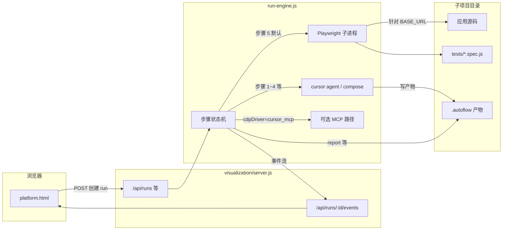

# AutoFlow 可视化闭环平台 — 步骤 2 架构拆解备忘录

> **面向执行代理：** 本备忘录对应流水线 **步骤 2（架构拆解）**，与 `skills-manifest.json` 中 `writing-plans` 绑定。后续步骤 4 的测试策略应对齐本文档中的模块边界与数据流。

**Goal：** 用一张「谁负责什么、数据怎么走、对外暴露什么、哪里容易翻车」的图式说明，支撑后续协作开发与测试生成，且优先 **最小改动** 演进。

**Architecture：** 平台进程（Express）承载 UI 与 REST/SSE；**编排核心** 在 `run-engine.js`（步骤状态机、产物路径、CDP/Playwright/MCP）；**子项目** 在 `projects/<runId>-<slug>/` 独立演进，证据写入 `.autoflow/`。**Skills** 通过 `cursor-cli-adapter` 注入 Cursor Agent 提示，不替代业务代码编译。

**Tech Stack：** Node.js、Express、Cursor CLI（`cursor agent`）、Playwright（默认步骤 5）、可选 Cursor MCP、SSE 实时日志。

**变更证据：** 本文档为 **新增** 架构备忘录；**无业务代码变更**。契约来源：`visualization/README.md`、`visualization/skills-manifest.json`、`visualization/run-engine.js`、`visualization/server.js`。

---

## 1. 模块（职责边界）

| 模块 | 主要职责 | 典型文件 |
|------|----------|----------|
| **Web UI** | 步骤勾选、运行触发、CDP 状态与日志展示 | `visualization/platform.html` |
| **HTTP 网关** | REST API、静态页、SSE 订阅、子项目起停辅助 | `visualization/server.js` |
| **运行引擎** | `enabledStepIds` 决策、1～8 步编排、产物读写、Playwright/MCP 路径 | `visualization/run-engine.js` |
| **Cursor 适配** | `runCompose`、prompt 中注入当前步骤 skill | `visualization/cursor-cli-adapter.js` |
| **Skills 契约** | 步骤编号 → skill 名称映射（运行前校验） | `visualization/skills-manifest.json` |
| **子项目工作区** | 需求生成的应用/测试代码；**不污染** `visualization/` 平台源码 | `visualization/projects/<runId>-<slug>/` |
| **运行证据** | 每步 Markdown/日志，供步骤间与人工追溯 | `projects/.../.autoflow/`（如 `01_requirement.md`、`04_test_strategy.md`、`report.md`） |
| **可选 CDP 冒烟** | 不经过完整流水线时的独立验证脚本 | `visualization/cdp-test-runner.js` |

**小白一句话：** 平台是「控制台 + 调度器」；真正写的业务代码在 **projects 子目录** 里，平台只负责按步骤调 skill、跑测试、记日志。

---

## 2. 数据流（端到端）

**关键行为（与「步骤像被跳过」相关）：**

- 引擎用请求体里的 **`enabledStepIds`** 决定是否执行某步（见 `run-engine.js` 中 `should(stepId)`）。
- **未启用步骤 5** 时：步骤 4 若跑完会 **直接结束主流程**，步骤 5～7 标记为 `skipped` — 这是设计行为，不是随机故障（详见 `README.md`「步骤 4 之后流水线」一节）。

---

## 3. 接口（对外与对内）

### 3.1 平台 HTTP API（节选）

| 方法 | 路径 | 用途 |
|------|------|------|
| POST | `/api/runs` | 创建并启动一次流水线（含 `enabledStepIds`、可选 `cdpDriver`、`targetPlatform` 等） |
| GET | `/api/runs/:id` | 查询单次 run 状态 |
| GET | `/api/runs/:id/events` | SSE：步骤日志与心跳 |
| POST | `/api/runs/:id/stop` | 停止 run |
| GET | `/api/completed-runs` / `/api/runs/completed` | 已完成列表 |
| POST | `/api/start-subproject` / `/api/stop-subproject` | 子项目进程生命周期（与本地调试相关） |
| GET | `/api/health` | 健康检查 |

**证据：** 路由注册见 `visualization/server.js` 中 `app.get` / `app.post` 段落。

### 3.2 子项目侧约定（步骤 5 默认 Web）

- 环境变量：**`BASE_URL`**、**`PORT`** 指向本地应用。
- 测试命令：**`npx playwright test tests`**，与 `tests/` 下 `*.spec.js` 对齐；`playwright.config.js` 的 **`webServer`** 负责拉起或复用服务。

### 3.3 内部契约

- **步骤 → skill：** `skills-manifest.json`（运行前校验 skill 文件存在）。
- **产物路径：** 各步骤写入 `projects/<id>-<slug>/.autoflow/`，后续步骤读取 strip 后的内容注入 prompt（见 `run-engine.js` 中 `readArtifactStripped` / `stripSkillHeader`）。

---

## 4. 风险与缓解

| 风险 | 影响 | 缓解 |
|------|------|------|
| **步骤 5 未勾选** | 5～7 跳过，误以为平台坏了 | 运行前确认 `enabledStepIds` 含 `5`；读 `.autoflow/report.md` 中「启用步骤」 |
| **Cursor CLI / 登录 / MCP** | MCP 路径失败或工具不可见 | 自动化优先 **Playwright**；MCP 需本机 `cursor agent mcp list` 与授权一致 |
| **子项目端口未就绪** | 测试 flaky 或超时 | `run-engine` 内有端口探测（如 `waitPort`）；本地保持 `PORT` 与配置一致 |
| **多次运行覆盖证据** | 历史追溯丢失 | 同一目录 `.autoflow/` 会覆盖；重要结果需另行归档或复制目录 |
| **步骤 4 与步骤 2 脱节** | 测试策略不对齐架构 | 步骤 4 应引用本文档模块边界；变更架构时同步更新备忘录或需求附件 |

---

## 5. 执行交接（writing-plans 约定）

本文件为 **架构拆解备忘录**，不是逐步改代码的 Implementation Plan。若需进入编码阶段，可另存仓库内 `docs/superpowers/plans/YYYY-MM-DD-<具体功能>-implementation.md`，按 `writing-plans` 的 Task/Step 模板拆分。

**可选执行方式：**

1. **Subagent-Driven** — 每任务独立子代理 + 任务间复核（与 `subagent-driven-development` 对齐）。
2. **Inline Execution** — 本会话内按任务执行（与 `executing-plans` 对齐）。

---

*生成方式：步骤 2 架构拆解；skill：`writing-plans`。*
