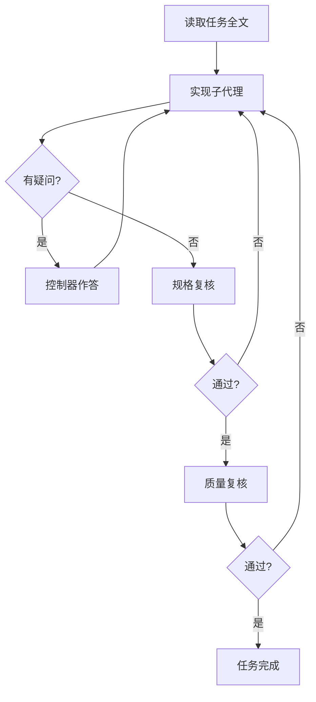

# AutoFlow 可视化闭环平台 — 步骤 3 多 Agent 协作开发备忘录

> **面向执行代理：** 本备忘录对应流水线 **步骤 3（多 Agent 协作完成开发）**，与 `visualization/skills-manifest.json` 中 **`subagent-driven-development`** 绑定。执行前应已有步骤 1～2 的产出（需求与架构拆解）；本步骤负责按 **独立任务** 推进实现，并在每任务后做 **两阶段复核**。

**Goal：** 在 **同一编排会话** 内，以「每任务一次干净上下文」的方式完成开发：先实现、再 **规格符合性**、再 **代码质量**，避免上下文污染与漏项；优先 **最小改动**、可回溯证据。

**Method：** `subagent-driven-development` — **每任务独立子代理** + **两阶段审查**（spec compliance → code quality）；控制器负责提取任务全文、注入场景上下文，**不让子代理自行读计划文件**（由控制器投喂完整任务文本）。

**变更证据：** 本文档为 **新增** 执行备忘录；**无业务代码变更**。契约来源：`visualization/skills-manifest.json`、`AutoFlow/.agents/skills/subagent-driven-development/SKILL.md`。

---

## 1. 角色（与 skill 对齐）

| 角色 | 职责 | 说明 |
|------|------|------|
| **规划 / 控制器** | 读 Implementation Plan、抽取任务清单与全文、维护 Todo、按序派发子任务、回答问题、禁止并行多个实现子代理 | 对应 skill 中的 coordinator；**不**在 `main` 上无确认大改 |
| **实现子代理** | 单任务编码、自测、自检、必要时提问；状态：`DONE` / `DONE_WITH_CONCERNS` / `NEEDS_CONTEXT` / `BLOCKED` | 机械任务可用较快模型；遇阻按 skill 升级模型或拆任务 |
| **规格复核子代理** | 对照任务描述：无遗漏、无多余；未通过则实现方修复后再审 | **必须先于** 代码质量审查 |
| **代码质量复核子代理** | 可读性、边界、测试与常量等工程质量；未通过则修复后再审 | 仅在规格 ✅ 后启动 |
| **收尾（可选）** | 全部任务完成后可做一次整体代码审阅，并接 `finishing-a-development-branch` 类流程 | 见 skill「Integration」 |

**小白一句话：** 一个人（控制器）拆任务、派活；每个干活的代理只看 **当前任务全文**；干完先问「做对了吗」，再问「写得好吗」。

---

## 2. 单任务循环（可执行顺序）

1. 从计划中提取 **下一条任务** 的完整文字与依赖上下文。
2. **派发实现子代理**（附：仓库路径、分支/worktree 约定、验收标准）。
3. 若实现方 **提问** → 控制器 **明确回答** 后再继续实现。
4. 实现方交付后 → **派发规格复核** → 不通过则实现方修改 → **重审直至通过**。
5. 规格通过后 → **派发代码质量复核** → 不通过则修改 → **重审直至通过**。
6. 标记该任务完成，进入下一任务；**禁止**在仍有未关闭审查问题时进入下一任务。
7. **禁止** 并行派发多个实现子代理（避免文件冲突）。

---

## 3. 与 AutoFlow 平台的衔接

- **步骤 → skill：** 步骤 3 运行前校验 `subagent-driven-development` 在 manifest 中已声明（当前已绑定）。
- **产物与追溯：** 业务代码与 `.autoflow/` 证据仍在 **`visualization/projects/<runId>-<slug>/`**；平台 `run-engine.js` 按步骤注入 prompt，不改变本备忘录中的 **子代理协作纪律**。
- **计划文件：** Implementation Plan 建议放在 `docs/superpowers/plans/YYYY-MM-DD-<功能>-implementation.md`，任务使用 `- [ ]` 勾选语法，便于控制器抽取（与 `writing-plans` 产出衔接）。

---

## 4. 红线（摘自 skill，执行时必守）

- 跳过 **规格** 或 **质量** 任一审查。
- 规格未 ✅ 即开始代码质量审查。
- 审查有问题未修复即标记任务完成或进入下一任务。
- 并行多个实现子代理。
- 让子代理自己去读计划文件而不由控制器提供任务全文。

---

## 5. 待验证项（人工或 CI）

- [ ] 当前 run 的 `enabledStepIds` 含步骤 **3**，且 Cursor CLI / 工作区可写子项目目录。
- [ ] Implementation Plan 中任务 **相互独立** 或依赖顺序已在任务文中写清。
- [ ] 每任务合并前：**规格复核** 与 **质量复核** 均有通过记录（或等价证据）。
- [ ] 若使用 git worktree：与 `using-git-worktrees` 约定一致，避免在 `main` 上直接堆叠未审查提交。

---

*生成方式：步骤 3 多 Agent 协作开发；skill：`subagent-driven-development`。*
